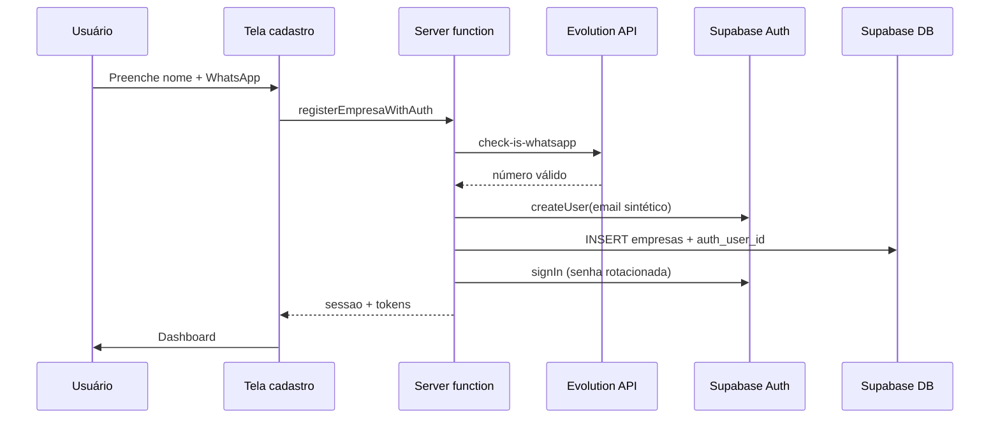

# Especificação completa — Cadastro, login, WhatsApp (Evolution) e painel admin

> **Documento único e portável** para outro agente implementar no **outro ERP** o mesmo modelo do **IndicaAí**: cadastro, login por OTP no WhatsApp, autenticação Supabase, configuração Evolution API e painel administrativo.  
> Idioma: português (Brasil). Referência de código: repositório IndicaAí.

---

## Como usar este documento

1. Leia o **glossário** e adapte nomes ao ERP destino.
2. Implemente na ordem do **checklist final** (Parte V).
3. **Não reutilize** a instância WhatsApp do IndicaAí — crie **instância nova** no mesmo servidor Evolution (ou outro), com nome e QR próprios.
4. Copie **fluxos e regras de segurança**, não arquivos inteiros sem adaptar.

Documento complementar (só painel admin, versão anterior): [ESPECIFICACAO-PAINEL-ADMIN-ERP.md](./ESPECIFICACAO-PAINEL-ADMIN-ERP.md) — o conteúdo relevante está **incorporado aqui**.

---

## Glossário — IndicaAí → outro ERP

| IndicaAí | Outro ERP (adaptar) |
| --- | --- |
| Loja | Empresa / tenant / cliente |
| Parceiro | Usuário indicador (opcional no ERP) |
| `/cadastro/loja` | `/cadastro/empresa` ou `/primeiro-acesso` |
| `/login` | Login da empresa |
| `/admin/login` | Login do superadmin / backoffice |
| `lojas` (tabela) | `companies`, `empresas`, etc. |
| Campo `categoria` | **Não obrigatório** no outro ERP — só nome + WhatsApp no primeiro acesso |
| `tipo: "loja"` na sessão | `tipo: "empresa"` ou equivalente |

---

# Parte I — Cadastro e login da empresa (loja)

## 1. Princípios gerais

- O usuário **nunca digita e-mail** na interface. O login é **sempre pelo WhatsApp**.
- Por baixo dos panos, o sistema cria um usuário no **Supabase Auth** com **e-mail sintético** (invisível ao usuário).
- O WhatsApp na UI usa **máscara brasileira** `(11) 9 8765-4321` em cadastro e login.
- OTP de 6 dígitos, válido **10 minutos**, enviado pela **Evolution API**.
- Após cadastro ou login bem-sucedido → **dashboard** da empresa (`/loja/dashboard` no IndicaAí → `/empresa/dashboard` no ERP).

## 2. Telas obrigatórias

### 2.1 Tela de login — `/login`

**Passo 1 — WhatsApp**

- Campo `PhoneField` com máscara (`formatPhoneMask` / `onlyDigits` → 11 dígitos).
- Botão **Enviar código**.
- Antes de enviar: verificar se o WhatsApp já tem conta (`checkWhatsappRegistered` no Supabase).
- Se não existir: mensagem clara + link para **cadastro**.

**Passo 2 — Código OTP**

- Campo de 6 dígitos (`LoginOtpField`).
- Botão **Entrar**.
- Opção **Reenviar código** (substitui OTP anterior no banco — usar só a última mensagem).

**Após confirmar**

1. Validar OTP em `login_otp` (hash SHA-256).
2. Abrir sessão Supabase Auth (`signInWithPassword` com senha rotacionada no servidor).
3. Gravar sessão app: `{ tipo: "loja", id: uuidDaEmpresa, nome }` em `localStorage`.
4. Redirecionar ao dashboard.

**Bloqueio:** se `lojas.status = inativo` (pausada pelo admin), login deve falhar com mensagem e contato de suporte.

### 2.2 Tela de cadastro / primeiro acesso — `/cadastro/loja`

No **IndicaAí**, campos:

| Campo | Obrigatório | Observação |
| --- | --- | --- |
| Nome da loja | Sim | |
| Responsável | Sim | No ERP pode ser só “nome da empresa” |
| WhatsApp | Sim | Máscara, 11 dígitos |
| Categoria | Sim (IndicaAí) | **No outro ERP: omitir** — só nome + WhatsApp |

No **outro ERP** (mínimo):

| Campo | Obrigatório |
| --- | --- |
| Nome da empresa | Sim |
| WhatsApp | Sim |

Fluxo ao clicar **Criar conta**:



**Importante:** no cadastro **não** envia OTP. A Evolution só valida se o número tem WhatsApp. O usuário entra direto no dashboard. OTP é só em **logins futuros**.

## 3. E-mail sintético (Supabase Auth)

O Supabase Auth exige e-mail. O usuário não vê isso.

```typescript
// IndicaAí — adaptar prefixo ao nome do ERP
function syntheticAuthEmail(tipo: "loja" | "parceiro", whatsapp11: string): string {
  return `indicaai_${tipo}_${whatsapp11}@gmail.com`;
}

// Exemplo outro ERP:
// erp_empresa_71996755745@gmail.com
```

Regras:

- Um WhatsApp = um e-mail sintético = um `auth.users.id`.
- Gravar `auth_user_id` na tabela da empresa.
- Senha: aleatória (`randomBytes`), rotacionada a cada login OTP no servidor.
- `email_confirm: true` na criação (sem confirmação por e-mail).

## 4. Server functions — empresa (contratos)

Implementar equivalentes a:

| Função | Quando | Entrada | Efeito |
| --- | --- | --- | --- |
| `verifyWhatsAppOnRegister` | Cadastro | `{ whatsapp: 11 dígitos }` | Evolution `check-is-whatsapp` |
| `registerLojaWithAuth` | Cadastro | nome, whatsapp, (+ campos ERP) | Auth user + INSERT loja + signIn + sessão |
| `checkWhatsappRegistered` | Login | `{ whatsapp }` | `{ exists: boolean }` |
| `requestLoginOtp` | Login passo 1 | `{ whatsapp }` | saveOtp → sendText Evolution |
| `confirmLoginOtp` | Login passo 2 | `{ whatsapp, code }` | verifyOtp → signIn → sessão |

Arquivos de referência no IndicaAí:

- `src/lib/api/auth.functions.ts`
- `src/lib/auth/supabase-auth.server.ts`
- `src/lib/auth/synthetic-email.ts`
- `src/lib/auth/otp-store.server.ts`
- `src/routes/login.tsx`, `src/routes/cadastro.loja.tsx`
- `src/components/form/fields.tsx` → `PhoneField`
- `src/components/auth/LoginOtpField.tsx`

## 5. OTP no Supabase (produção obrigatória)

Tabela `schema.login_otp`:

```sql
CREATE TABLE schema.login_otp (
  whatsapp text PRIMARY KEY,
  code_hash text NOT NULL,
  expires_at timestamptz NOT NULL,
  created_at timestamptz DEFAULT now()
);
-- RLS: apenas service_role (ver migration IndicaAí 20260606110000_login_otp_rls.sql)
```

Fluxo seguro:

1. Gerar código 6 dígitos.
2. **`saveOtp` no Supabase ANTES** de enviar WhatsApp.
3. Se `saveOtp` falhar → **não enviar** mensagem (evita código órfão).
4. Enviar texto via Evolution.
5. `confirmLoginOtp` valida hash; só depois `consumeOtp` (apaga) se sessão abrir.

Propósitos de OTP no IndicaAí: `login` (empresa/parceiro) e `admin_login` (admin).

## 6. UI — máscara e validação WhatsApp

- **Máscara:** `(DD) 9 XXXX-XXXX` — armazenar sempre **11 dígitos** (`onlyDigits`).
- **Validação Zod:** `whatsapp: z.string().regex(/^\d{11}$/)`.
- **Exibição:** `formatWhatsappDisplay` quando mostrar ao usuário.
- **Evolution:** enviar com DDI `55` + 11 dígitos (`toEvolutionNumber`).

## 7. Parceiro (opcional)

O IndicaAí também cadastra **parceiros** (`/cadastro/parceiro`) com nome + WhatsApp e o mesmo padrão Auth + OTP em `/login`. Se o outro ERP não tiver parceiros, ignore esta seção.

---

# Parte II — Login e papel administrador

## 8. Admin no IndicaAí (como funciona hoje)

- Rota: `/admin/login` (isolada do login da empresa).
- **Não** usa tabela `admin_users` no Supabase Auth.
- Autorização: **`ADMIN_WHATSAPP_ALLOWLIST`** no `.env` / secrets do servidor.
- Sessão: `{ tipo: "admin", id: whatsapp11, nome: "Administração" }` em `localStorage`.
- Operações admin no banco: **service role** no servidor (`assertAdminWhatsappAllowed`).

### 8.1 Preparar superadmin antes do primeiro login

**Passo A — Allowlist (obrigatório)**

```env
ADMIN_WHATSAPP_ALLOWLIST=71996755745
```

Apenas WhatsApps listados podem pedir OTP admin. Múltiplos: separados por vírgula.

**Passo B — Usuário admin no Supabase (opcional no IndicaAí)**

No IndicaAí o admin **não** precisa de linha em `auth.users`. Se o outro ERP quiser auditoria extra, pode criar:

```sql
-- Opcional no ERP destino
CREATE TABLE schema.admin_users (
  id uuid PRIMARY KEY DEFAULT gen_random_uuid(),
  whatsapp text UNIQUE NOT NULL,
  nome text NOT NULL,
  role text NOT NULL DEFAULT 'superadmin', -- superadmin | admin
  ativo boolean NOT NULL DEFAULT true,
  created_at timestamptz DEFAULT now()
);

INSERT INTO schema.admin_users (whatsapp, nome, role)
VALUES ('71996755745', 'Super Admin', 'superadmin');
```

Mesmo com essa tabela, **validar allowlist + OTP no servidor** (defesa em profundidade).

### 8.2 Fluxo login admin (igual ao da empresa, com allowlist)

```mermaid
flowchart LR
  A[WhatsApp + máscara] --> B{Na allowlist?}
  B -->|não| C[Erro acesso negado]
  B -->|sim| D[Enviar OTP admin_login]
  D --> E[WhatsApp recebe código]
  E --> F[Digita OTP 6 dígitos]
  F --> G[Sessão tipo admin]
  G --> H[/admin/dashboard]
```

Server functions (IndicaAí: `src/lib/api/admin.functions.ts`):

- `checkAdminWhatsappAllowed`
- `requestAdminLoginOtp` — propósito `admin_login`
- `confirmAdminLoginOtp`

Mensagem WhatsApp admin (exemplo):

```text
*SeuApp Admin* — Seu código de acesso: *123456*
Válido por 10 minutos. Não compartilhe.
```

---

# Parte III — Evolution API (envio de OTP e configuração)

## 9. Regra de ouro: instância separada

| ❌ Proibido | ✅ Correto |
| --- | --- |
| Usar a mesma instância WhatsApp do IndicaAí | Criar **nova instância** no Evolution para o outro ERP |
| Compartilhar número que dispara OTP do IndicaAí | Número/instância dedicados ao novo sistema |

Todas as mensagens de OTP (empresa, parceiro, admin) saem da **instância configurada para aquele projeto**.

## 10. Variáveis de ambiente (servidor — nunca no client)

```env
# URL base da Evolution (sem barra no final)
EVOLUTION_API_URL=https://whats.seudominio.com

# API key (header apikey)
EVOLUTION_API_KEY=sua-chave-secreta

# Nome da instância — BOOTSTRAP inicial (ver seção 11)
EVOLUTION_INSTANCE=nome-instancia-erp-dev

# Desenvolvimento local sem WhatsApp real:
EVOLUTION_MOCK=true
```

Com `EVOLUTION_MOCK=true`, o código OTP aparece no toast (dev only).

**Nunca** commitar `.env` com chaves reais.

## 11. Bootstrap: instância manual no `.env` (fase 1)

Antes do painel admin estar pronto, o implementador pode:

1. No painel Evolution, **criar manualmente** uma instância nova (ex.: `erp-upcao-otp`).
2. Conectar o WhatsApp (QR ou pairing) nessa instância.
3. Colocar o **nome exato** em `EVOLUTION_INSTANCE` no `.env` / secrets Cloudflare.
4. Subir o app → cadastro e login já disparam OTP por essa instância.

Ordem de resolução do nome da instância no IndicaAí (`resolveEvolutionInstanceName`):

1. `system_settings` chave `evolution` → `instance_name` (se preenchido no banco)
2. Senão → `EVOLUTION_INSTANCE` do `.env`

Assim o `.env` funciona como **fallback** até o admin configurar pelo painel.

## 12. Fase 2 — Configuração WhatsApp no painel admin

Rota: `/admin/configuracoes` (seção Evolution).

### 12.1 Persistência no Supabase

```json
// system_settings key = "evolution"
{
  "instance_name": "erp-producao-2026",
  "connection_state": "open",
  "connected_at": "2026-06-06T12:00:00Z"
}
```

URL e API key **permanecem no servidor** (`.env`). Só o **nome da instância** e estado vão ao banco.

### 12.2 Fluxo na UI admin

1. Admin informa **nome da instância** (ex.: `erp-producao-2026`).
2. **Salvar** → `ensureEvolutionInstance` na Evolution API + `UPSERT system_settings`.
3. **Gerar QR Code** → `connect` na Evolution; exibir imagem base64.
4. Admin escaneia QR no WhatsApp (ou código de pareamento com `55` + WhatsApp do admin).
5. UI faz **polling** do estado até `connection_state = open`.
6. A partir daí, **todos os OTPs** usam essa instância (prioridade sobre `.env`).

### 12.3 Migração instância manual → instância do painel

Procedimento recomendado (como você descreveu):

1. **Desenvolvimento:** instância criada à mão + `EVOLUTION_INSTANCE` no `.env` → testes de cadastro/login.
2. **Produção:** admin loga → `/admin/configuracoes` → define nome novo → gera QR → conecta WhatsApp do projeto.
3. **Opcional:** apagar instância antiga de teste no painel Evolution (a do IndicaAí **não** deve ser tocada).
4. Remover ou deixar `EVOLUTION_INSTANCE` só como fallback de emergência.

### 12.4 Endpoints Evolution usados (IndicaAí)

| Ação | Método / path |
| --- | --- |
| Verificar WhatsApp | `POST /chat/whatsappNumbers/{instance}` |
| Enviar OTP | `POST /message/sendText/{instance}` |
| Criar instância | API admin Evolution (`ensureEvolutionInstance`) |
| QR / connect | API admin (`fetchEvolutionConnectQr`) |
| Estado conexão | API admin (`fetchEvolutionConnectionState`) |

Código: `src/lib/evolution/client.server.ts`, `src/lib/evolution/instance.server.ts`.

---

# Parte IV — Painel administrativo (lojas/empresas, billing, config)

## 13. Objetivo do painel admin

O operador da plataforma pode:

1. Ver **todas as empresas** cadastradas.
2. Abrir detalhe e ver **situação de pagamento** + histórico.
3. **Ativar / desativar** empresa (independente do pagamento).
4. Configurar **valor do plano**, suporte e **WhatsApp (Evolution)**.
5. Trabalhar com dados no **Supabase** + **Realtime** onde aplicável.

## 14. Rotas admin (IndicaAí)

| URL | Função |
| --- | --- |
| `/admin/login` | OTP + allowlist |
| `/admin/dashboard` | Métricas (período De/Até) |
| `/admin/lojas` | Listagem, busca, pausar/ativar |
| `/admin/lojas/{id}` | Detalhe, campanhas, pagamentos |
| `/admin/configuracoes` | Plano, suporte, Evolution + QR |
| `/admin/parceiros` | (opcional IndicaAí) |

`/admin` → redirect dashboard.

## 15. Dois eixos de status (empresa)

### Status operacional — `status`

| Valor | Efeito |
| --- | --- |
| `ativo` | Login liberado |
| `inativo` | Login **bloqueado** (pausa manual admin) |

### Status pagamento — `billing_status`

| Valor | Significado |
| --- | --- |
| `trial` | Período grátis inicial |
| `ativo` | Plano em dia |
| `pendente` | Sem pagamento após trial |
| `inadimplente` | Atraso |

**Independentes:** empresa pode estar com plano `ativo` e `status = inativo`.

## 16. Tabelas Supabase (resumo)

Schema dedicado (ex.: `indicaai` / `erp`):

| Tabela | Uso |
| --- | --- |
| `lojas` / `empresas` | Cadastro, `auth_user_id`, billing, `status` |
| `login_otp` | Hash OTP (service role only) |
| `system_settings` | `billing`, `admin`, `evolution` |
| `billing_payments` | Histórico PIX |
| `validacoes`, `comissoes` | Se o domínio tiver indicações |

Realtime: publicar tabelas que a UI espelha (`lojas`, `billing_payments`, `system_settings`, etc.).

## 17. Server functions admin (resumo)

Todas exigem `adminWhatsapp` na allowlist:

- `listarLojasAdmin`, `obterLojaAdmin`, `setLojaPausadaAdmin`
- `listarPagamentosPlanoAdmin`
- `getAdminSettings`, `saveAdminBillingPlan`, `saveAdminEvolutionInstance`, `getEvolutionQrAdmin`

Referência: `src/lib/api/admin.functions.ts`, `src/lib/admin/admin.server.ts`.

## 18. Segurança

- `SUPABASE_SERVICE_ROLE_KEY` **só no servidor**.
- `EVOLUTION_API_KEY` **só no servidor**.
- `ADMIN_WHATSAPP_ALLOWLIST` **só no servidor**.
- Cliente: anon key + leitura; escrita via server functions.
- Admin: validar allowlist em **cada** request.

---

# Parte V — Checklist de implementação (ordem sugerida)

## Fase 1 — Infra e WhatsApp

- [ ] Criar projeto Supabase + schema isolado do ERP legado.
- [ ] Aplicar migrations: `empresas`, `login_otp`, `system_settings`, billing.
- [ ] Criar **instância Evolution nova** (não a do IndicaAí).
- [ ] Configurar `.env`: `SUPABASE_*`, `EVOLUTION_*`, `ADMIN_WHATSAPP_ALLOWLIST`.
- [ ] Testar envio manual `sendText` com a instância.

## Fase 2 — Cadastro e login empresa

- [ ] Tela `/cadastro/...` — nome + WhatsApp (máscara); sem categoria no ERP destino.
- [ ] `registerEmpresaWithAuth`: Evolution check → Auth user → INSERT → signIn → dashboard.
- [ ] Tela `/login` — WhatsApp máscara → OTP → dashboard.
- [ ] `saveOtp` antes de enviar WhatsApp; migration `login_otp` + service role.
- [ ] E-mail sintético + `auth_user_id` na empresa.
- [ ] Bloquear login se `status = inativo`.

## Fase 3 — Login admin

- [ ] Tela `/admin/login` — mesma UX (máscara + OTP).
- [ ] Allowlist + OTP `admin_login`.
- [ ] Guard `sessao.tipo === "admin"` em `/admin/*`.
- [ ] (Opcional) tabela `admin_users` com `superadmin`.

## Fase 4 — Painel admin

- [ ] `/admin/lojas` — listagem, billing badge, pausar/ativar.
- [ ] `/admin/lojas/{id}` — detalhe + pagamentos.
- [ ] `/admin/configuracoes` — valor plano, suporte, Evolution.
- [ ] QR Code + polling conexão; persistir `instance_name` no Supabase.
- [ ] Realtime / hydrate conforme IndicaAí.

## Fase 5 — Aceite final

- [ ] Cadastro empresa → dashboard sem OTP.
- [ ] Logout → login com OTP no WhatsApp.
- [ ] Admin allowlist → OTP → painel.
- [ ] OTP sai da instância do **projeto**, não do IndicaAí.
- [ ] Após configurar QR no admin, instância do `.env` deixa de ser necessária.
- [ ] Alterar valor do plano reflete em `system_settings` e novas cobranças.
- [ ] Pausar empresa bloqueia login.

---

## Referência rápida — arquivos IndicaAí

| Tema | Caminhos |
| --- | --- |
| Cadastro/login empresa | `auth.functions.ts`, `login.tsx`, `cadastro.loja.tsx` |
| Login admin | `admin.functions.ts`, `admin.login.tsx`, `allowlist.server.ts` |
| OTP | `otp-store.server.ts`, migration `20260606110000_login_otp_rls.sql` |
| Supabase Auth | `supabase-auth.server.ts`, `synthetic-email.ts` |
| Evolution | `client.server.ts`, `instance.server.ts`, `config.server.ts` |
| Config admin + QR | `admin.configuracoes.tsx`, `system-settings.server.ts` |
| Máscara telefone | `validation/masks.ts`, `PhoneField` em `form/fields.tsx` |
| Painel lojas | `admin.lojas.*`, `admin.server.ts` |
| Docs internas | `AUTENTICACAO.md`, `ADMIN.md`, `BILLING.md`, `SUPABASE.md` |

---

## Mensagem pronta para colar no outro agente

```text
Implemente no nosso ERP conforme docs/ESPECIFICACAO-IMPLEMENTACAO-ERP.md:

1) Cadastro primeiro acesso: nome da empresa + WhatsApp (máscara BR), sem categoria.
   Criar auth.users com e-mail sintético, gravar empresa no Supabase, entrar direto no dashboard.

2) Login: mesma máscara WhatsApp → OTP 6 dígitos via Evolution → dashboard.
   saveOtp no Supabase ANTES de enviar WhatsApp.

3) Admin: /admin/login com ADMIN_WHATSAPP_ALLOWLIST + OTP igual ao da empresa.
   Painel: listar empresas, billing, pausar/ativar, configurações (plano + Evolution QR).

4) Evolution: NOVA instância (não usar a do IndicaAí). Bootstrap com EVOLUTION_INSTANCE no .env;
   depois admin configura instância definitiva via QR em /admin/configuracoes (nome no Supabase).

5) Segurança: service role e API keys só no servidor; Realtime no Supabase.
```

---

*Última atualização: 2026-06-06 — IndicaAí (cadastro, OTP Evolution, Supabase Auth, painel admin).*
